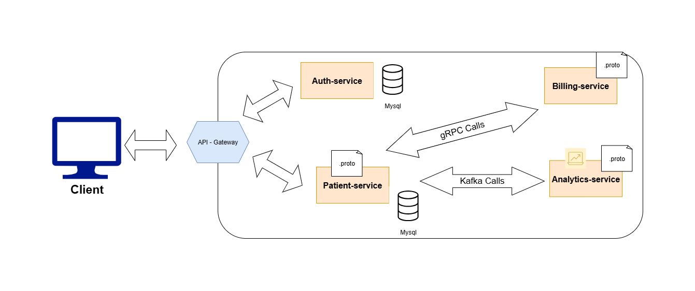

# Patient Management System (Microservices)

This project is a **Spring Boot microservices-based system** designed for managing patients.  
The architecture follows modern distributed system principles, with each service independently containerized and orchestrated using **Docker Compose**.  

---

## Project Overview
- **Microservices**: Each business capability (e.g., patient, doctor, auth, etc.) is implemented as a separate Spring Boot service.
- **Communication**:  
  - **gRPC** → For efficient service-to-service communication.  
  - **Apache Kafka** → For asynchronous event-driven communication.  
- **Containerization**: Every microservice has its own `Dockerfile`.  
- **Orchestration**: `docker-compose.yml` is used to spin up the entire system with one command.  

---

## System Architecture
   

---

## Technologies
- **Java / Spring Boot**
- **gRPC**
- **Apache Kafka**
- **Docker & Docker Compose**
- **MySQL / PostgreSQL (per-service database)**

---

## How to Run

### 1. Clone the repository
```bash
git clone https://github.com/<your-username>/patient-management.git
cd patient-management

# build 
docker compose build

# instantiate containers
docker compose up

# stop containers
docker compose down
```

##  Notes
- Each service has its own Dockerfile and database instance.
- All inter-service communication is handled through gRPC and Kafka.
- The system can be scaled by increasing replicas of individual services in docker-compose.yml.

